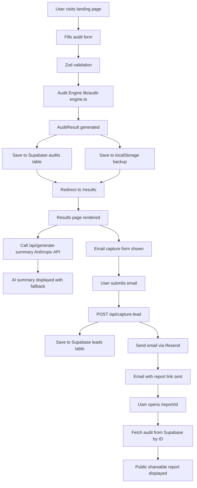

# ARCHITECTURE.md

## What This Is

AI Spend Audit is a free web tool that helps startup founders and engineering
managers audit their AI tool subscriptions, find overspending, and get
actionable savings recommendations.

---

## System Diagram

---

## Data Flow

1. **User fills form** — tool name, plan, seats, monthly spend, use case
2. **Zod validates** the form data client-side before submission
3. **Audit engine runs** — pure deterministic TypeScript logic, no AI, applies 4 rules: tier right-sizing, annual billing discount, bill accuracy, alternatives
4. **Result saved** to Supabase audits table and localStorage as backup
5. **Results page loads** — reads from localStorage immediately, fetches AI summary from Anthropic API in background
6. **Email captured** — saved to Supabase leads table, Resend sends confirmation email with shareable link
7. **Shareable URL** — /report/[id] fetches audit from Supabase by ID

---

## Stack Choices

### Next.js 14 App Router
Chosen over plain React or Vite because the assignment requires shareable
URLs with proper OpenGraph metadata, which needs server-side rendering.
App Router gives us per-page metadata, server components, and API routes
in one framework without extra infrastructure.

### TypeScript (strict)
All types defined in /types directory. Strict mode catches bugs at
compile time. The audit engine is fully typed — AuditFormData in,
AuditResult out.

### Supabase
Chosen over Firebase because it is Postgres (relational, queryable),
has a generous free tier, built-in Row Level Security, and a simple
JavaScript client. No ORM needed for this scale.

### Resend
Chosen over SendGrid or SES because it has the simplest Next.js
integration (one npm package, one API call), free tier covers early
traction, and deliverability is strong.

### Tailwind CSS + shadcn/ui
Tailwind for utility-first styling with no CSS files to manage.
shadcn/ui for accessible, unstyled primitives that we fully control.

### Anthropic Claude API
Used only for the 100-word personalized summary on the results page.
The audit logic itself is hardcoded rules — knowing when NOT to use AI
is part of the engineering judgment here.

---

## Folder Structure

    app/
      api/
        capture-lead/         POST: save lead + send email
        generate-summary/     POST: Anthropic AI summary
      audit/                  Audit form page
      results/                Results dashboard
      report/[id]/            Public shareable report

    components/
      ui/                     shadcn/ui primitives
      layout/                 Header, Footer
      shared/                 StatCard, SeverityIcon

    features/
      landing/                Hero, Benefits, FAQ, SavingsExample
      audit/                  AuditForm, ToolRow, useAuditForm
      results/                ResultsHero, RecommendationCard, LeadCaptureForm

    lib/
      audit-engine.ts         Core audit logic
      supabase.ts             Supabase client
      storage.ts              localStorage helpers
      utils.ts                Shared utilities

    types/                    TypeScript definitions
    data/                     Static pricing registry
    tests/                    Jest test suites

---

## Scaling to 10,000 Audits/Day

Current architecture handles around 100 audits/day comfortably on Vercel
free tier and Supabase free tier. To scale to 10k/day:

1. **Audit engine** — already stateless and fast under 5ms. No changes needed.
   Could be moved to a Vercel Edge Function for lower latency globally.

2. **Database** — Supabase free tier handles around 500 concurrent connections.
   At 10k audits/day upgrade to Supabase Pro at $25/month or add a connection
   pooler (PgBouncer). Indexes on created_at and id are already in place.

3. **Email sending** — Resend free tier is 100 emails/day. At 10k audits,
   assume 20% email capture equals 2,000 emails/day. Upgrade to Resend Pro
   at $20/month or use SES at $0.10 per 1000 emails.

4. **Anthropic API** — at 10k audits, AI summary costs around $0.50/day at
   Haiku pricing. Add a queue using Inngest or Upstash QStash so summaries
   generate async and do not block page load.

5. **Rate limiting** — add Upstash Redis rate limiting on /api/capture-lead
   and /api/generate-summary to prevent abuse.

6. **Caching** — cache audit results in Vercel KV for 24 hours so repeated
   views of the same report do not hit Supabase every time.